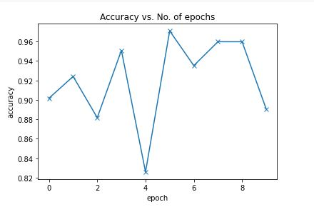
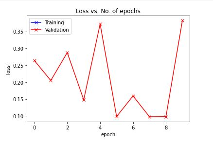

# FaceMask-Detection

Real time Face Mask Detection algorithm using concepts of Deep Learning and Machine Learning to determine whether an individual is wearning a mask or not. The model was using multivariate Linear Regression via PyTorch. This was used with OpenCv facial recognition deeplearning model to detect all the faces and pass them through our Face Mask Detection Model. 

A demonstration of Real Time Face Mask Detetction can be found below:

The Dataset was obtained from kaggle and can be found [here](https://www.kaggle.com/ashishjangra27/face-mask-12k-images-dataset).
The Dataset consists of over 12000 images. 

## Model Results 
After training our model has reached **97%** validation accuracy and **9.8%** validation loss. The plots can be observed below.  
### Model Accuracy

### Model Losses

